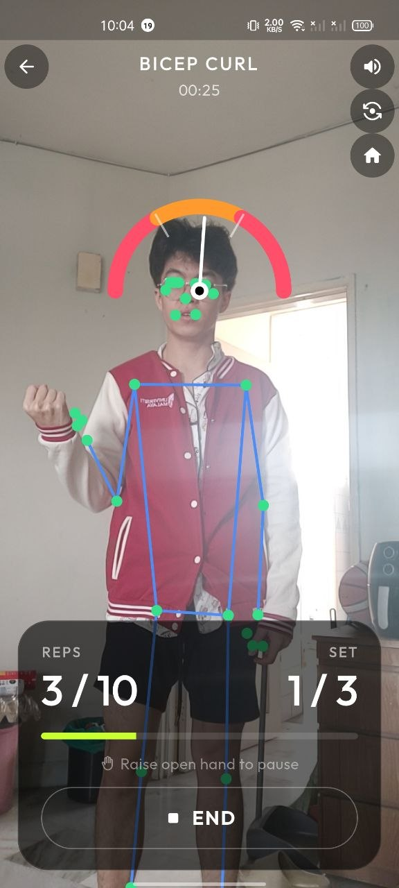
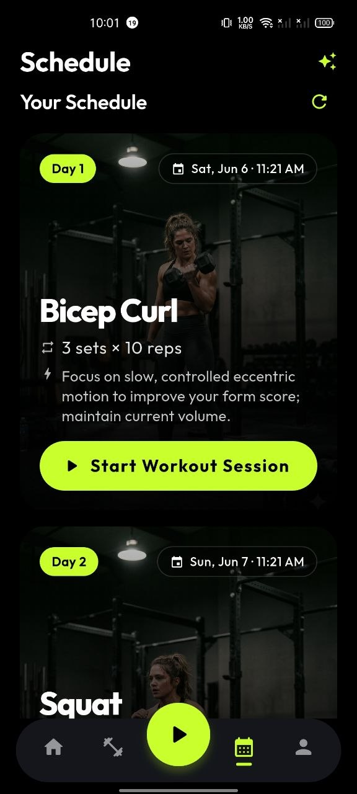
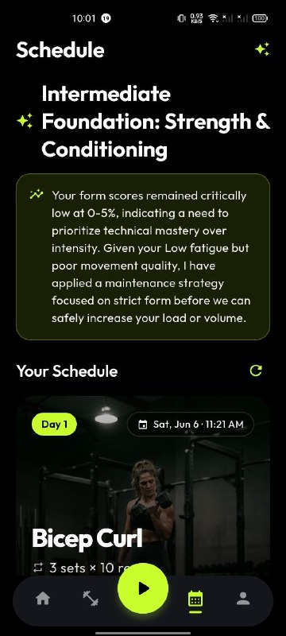
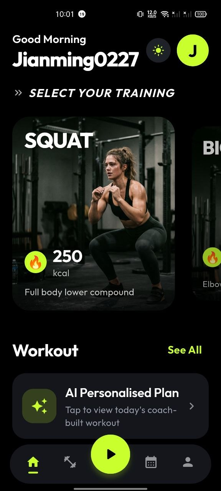
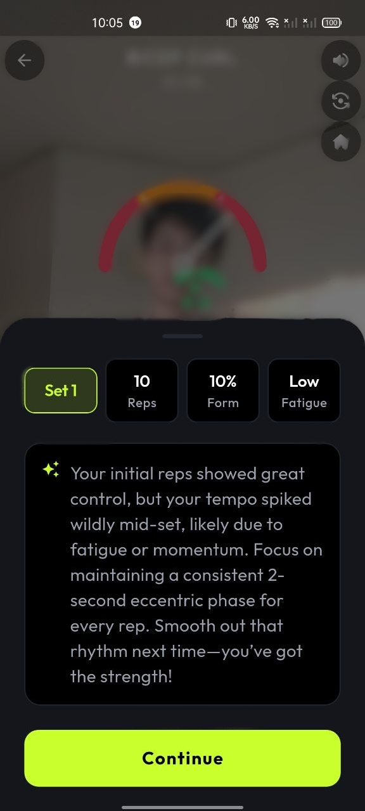

<div align="center">

# 🏋️ FitForm

**An AI form coach inside your phone camera.**

FitForm watches you exercise through the front camera, counts your reps, scores your form in real time,
calls out corrections by voice, and after each session generates an adaptive 3-day training plan from what
it actually observed — your fatigue, your form score, your time under tension.

Flutter · on-device pose detection (ML Kit BlazePose) · Gemini · Supabase

</div>

---

## Why FitForm

Most people training at home have no idea whether their form is correct. Bad form means injury and wasted
effort, and a personal trainer is expensive. FitForm puts a real-time form coach into the one device
everyone already owns — and because pose detection runs **fully on-device**, it works offline and never
sends camera frames to a server.
---

## Screenshots

<table>
  <tr>
    <td align="center"><b>Live form tracking</b></td>
    <td align="center"><b>Adaptive plan</b></td>
    <td align="center"><b>Session summary</b></td>
  </tr>
  <tr>
    <td align="center"></td>
    <td align="center"></td>
    <td align="center"></td>
  </tr>
  <tr>
    <td align="center" width="240">Skeleton overlay, form gauge, live rep count</td>
    <td align="center" width="240">Gemini-generated 3-day plan (server-driven UI)</td>
    <td align="center" width="240">Per-set form, fatigue &amp; TUT breakdown</td>
  </tr>
  <tr>
    <td align="center"><b>Home dashboard</b></td>
    <td align="center"><b>Coaching tip</b></td>
    <td align="center"><b>Demo</b></td>
  </tr>
  <tr>
    <td align="center"></td>
    <td align="center"></td>
    <td align="center">▶️ <a href="https://drive.google.com/file/d/1nldqb2lDE54p5CAUSVDbVq4gwWlGMRIH/view?usp=sharing"><b>Watch the demo</b></a></td>
  </tr>
  <tr>
    <td align="center" width="240">Streak, recent activity, AI panel</td>
    <td align="center" width="240">Streamed post-set Gemini feedback</td>
    <td align="center" width="240">Full app walkthrough</td>
  </tr>
</table>

---

## Key Features

### 1. Real-time form tracking & rep counting
- Live skeleton overlay from **33 ML Kit BlazePose landmarks**, computed on-device at camera frame rate.
- A single joint angle (hip→knee→ankle for squats, shoulder→elbow→wrist for curls) drives **four
  subsystems at once**: a form-quality gauge, a time-under-tension timer, spoken coaching cues, and a
  hardened rep counter.
- **Three independent guards** against false reps (see [Rep counting](#rep-counting--three-guards)).
- Hands-free control: open-hand gesture to start, raised-hand "high five" to pause/resume — so you never
  touch the phone mid-set.

### 2. AI coaching & adaptive planning (Gemini)
- After each set: a streamed **prose coaching tip** ("nice depth — control the way up next set").
- After each session: an **adaptive 3-day plan**. The model reasons inside explicit guardrails —
  fatigue → maintenance + recovery day, low fatigue → progressive overload capped by experience level and
  form score, beginners never get load increases.
- The plan is **server-driven UI**: Gemini emits a typed JSON schema, and the app renders it through a
  widget factory — new card types need zero redeploys.

---

## Tech Stack

| Layer | Technology | Why |
|---|---|---|
| UI | **Flutter** (Android) | Single codebase, mature camera/ML/TTS plugins, hot reload for tuning overlays live |
| State | **Riverpod** | Compile-safe providers, clean separation of UI / logic / services |
| Routing | **GoRouter** | Declarative, auth-aware redirect driven by the Supabase auth stream |
| Pose detection | **Google ML Kit — BlazePose** | Runs on-device: offline, private, no cloud round-trip |
| AI | **Gemini** (`google_generative_ai`) | Two models — prose for coaching, JSON-mode for the adaptive plan |
| Auth & cloud DB | **Supabase** (Postgres + Row-Level Security) | Email auth + best-effort sync of profile / plan / sessions |
| Local storage | **SharedPreferences** | Local-first source of truth, uid-keyed for multi-account isolation |
| Voice | **flutter_tts** | Spoken form cues and motivation |

Full dependency list in [`pubspec.yaml`](pubspec.yaml).

---

## Architecture

Four layers, top (user-facing) to bottom (data). Full diagram: [`docs/architecture_diagram.svg`](docs/architecture_diagram.svg).

```
① PRESENTATION  · Flutter/Android   Home · Train · Camera · Plan · Profile   (GoRouter auth)
        │ ref.watch / ref.read
② STATE         · Riverpod          authController · profileController · planController · geminiService
        │
③ INTELLIGENCE  ┌ ON-DEVICE  : frame → BlazePose (33 lm) → joint angle → [form gauge | TUT | TTS | rep machine]
                └ CLOUD AI    : Gemini  (text → coaching · json → plan) → Dynamic UI Parser → native cards
        │ SetMetrics + plan JSON
④ DATA          SharedPreferences (local-first, uid-keyed)  ◀──►  Supabase (best-effort, Auth + RLS)
```

### The camera pipeline (`lib/features/train/views/camera_view.dart`)
Each camera frame runs through one pipeline. A backpressure flag (`_isDetecting`) drops frames while ML Kit
is busy, so processing never lags behind the camera:

```
camera frame (NV21) → InputImage → PoseDetector (33 landmarks) → one joint angle
                                                                      │
              ┌───────────────────┬──────────────────┬───────────────┤
              ▼                   ▼                  ▼               ▼
         form gauge          TUT timer          TTS cues        rep state machine
       (green-zone %)      (ms in zone)     (out of zone 1.5s)   (three guards)
```

### Rep counting — three guards
The rep counter is extracted into a pure-Dart, **unit-tested** state machine
(`lib/features/train/models/rep_state_machine.dart`). A rep only counts if it survives all three:

1. **Confidence gate** — every tracked landmark must clear ML Kit likelihood ≥ `0.55`, or the frame
   produces no angle. Noise is killed before any logic runs.
2. **Strict crossing thresholds** — the joint must cross two tight angles (tighter than the form-gauge
   zone), so half-reps and casual movement physically cannot count.
3. **Minimum phase duration** — the opposite phase cannot fire for `minRepDurationMs`, killing sub-second
   landmark jitter.

All thresholds live as data on the `Exercise` config — see [`EXERCISE_PARAMS.md`](EXERCISE_PARAMS.md).

### Server-driven UI (`lib/features/plan/widgets/dynamic_ui_parser.dart`)
Gemini returns a typed JSON tree (`WorkoutPlanView` → `SessionCard[]`). `buildDynamicWidget` switches on
each node's `type` and renders the matching Flutter widget — recursively, with a null-safe fallback on every
field, because LLM output is treated as untrusted input. Each card's `actionId` maps back to a typed
`Exercise`, so tapping **Start** launches the camera session that generates the data for the next plan — a
closed loop with the AI.

### Data & persistence
- **Local-first.** SharedPreferences is the source of truth; keys are prefixed with the Supabase user id
  (or `'demo'` offline) so multiple accounts on one device stay isolated. Sign-out clears all local data.
- **Best-effort cloud.** Every Supabase write is wrapped in try/catch and never rethrown — a network
  failure never blocks the app. All database CRUD is funnelled through one repository,
  [`SupabaseService`](lib/services/supabase_service.dart).

---

## Project Structure

```
lib/
├── main.dart / app.dart        # bootstrap: dotenv, Supabase init, MaterialApp.router
├── router/                     # GoRouter + auth-aware redirect
├── core/                       # colors, text styles, theme, shared widgets
├── services/
│   ├── supabase_service.dart   # auth + ALL database CRUD (repository layer)
│   └── gemini_service.dart     # two Gemini models, both prompts, streaming
└── features/
    ├── auth/                   # login / register, auth controller
    ├── profile/                # biometric survey, profile persistence
    ├── home/                   # greeting, AI panel, recent-activity dashboard
    ├── train/
    │   ├── models/             # exercise.dart (config catalog), rep_state_machine.dart
    │   ├── views/camera_view.dart   # the camera + ML Kit pipeline
    │   └── widgets/            # pose painter, form gauge, coaching sheet
    ├── plan/                   # PlanController + dynamic_ui_parser (server-driven UI)
    ├── session/                # session summary, Supabase write, plan trigger
    └── shell/                  # bottom-nav shell
test/
└── features/train/rep_state_machine_test.dart   # 10 unit tests for the rep counter
```

---

## Getting Started

### Prerequisites
- Flutter SDK (Dart `^3.10.8`) — [install guide](https://docs.flutter.dev/get-started/install)
- An Android device or emulator (camera features require a **physical device** to test properly)
- A Supabase project and a Gemini API key

### 1. Clone & install
```bash
git clone <repo-url>
cd fitness
flutter pub get
```

### 2. Configure environment
The app loads secrets from `.env` (declared as a Flutter asset). Copy the template and fill in real values:
```bash
cp .env.example .env
```
```env
SUPABASE_URL=https://your-project.supabase.co
SUPABASE_ANON_KEY=your-supabase-anon-key
GEMINI_API_KEY=your-gemini-api-key
```
- Supabase URL & anon key → Supabase dashboard → **Project Settings → API**
- Gemini key → [Google AI Studio](https://aistudio.google.com/app/apikey)

`.env` is gitignored — never commit your populated file.

### 3. Supabase tables
Create three tables (all with Row-Level Security scoped to `auth.uid()`):
`profiles`, `plans`, `workout_sessions`. Column shapes are visible in
[`lib/services/supabase_service.dart`](lib/services/supabase_service.dart).

### 4. Run
```bash
flutter run                 # on a connected device
flutter run -d <device-id>  # pick a specific device
flutter build apk           # release build
```

---

## Testing & Quality

```bash
flutter test       # run the unit suite (rep state machine — 10 tests)
flutter analyze    # static analysis / lints
```

The rep counter is the one place where a bug is invisible and costly (a phantom or missed rep), and it has
the most edge cases — so it is extracted into a pure-Dart class and locked down with tests covering full
reps, shallow-rep rejection, and sub-duration jitter rejection. Testing concentrates where bugs are likely,
hidden, and expensive.

---

## Key Technical Decisions

- **On-device pose detection.** No cloud round-trip → works offline, zero latency, and camera frames never
  leave the phone (privacy). Trade-off accepted: less low-level camera control than native Camera2.
- **Config-driven exercises.** Every biomechanical threshold lives in one `Exercise` object. Adding an
  exercise is a *data* change, not a code change — the camera, rep counter, and gauge all read parameters at
  runtime.
- **Guardrailed LLM, deterministic edges.** Dates, the JSON schema, the exercise whitelist, and progression
  caps are computed in Dart; the model only reasons *inside* those bounds. JSON mode + a defensive parser
  keep the UI schema-locked.
- **Local-first, best-effort cloud.** The app is fully usable offline; Supabase is a sync bonus that can
  never block or crash the experience.

---

## Known Limitations & Future Work

- **Two exercises** (Squat, Bicep Curl) — the architecture supports more via config + prompt whitelist.
- **Session history depth** — Gemini currently sees recent local summaries; the next step is reading the
  full Supabase history back for real trend analysis ("your squat form improved 12% over 3 weeks").
- **Frame throughput** — pose detection is gated by a backpressure lock; lower detection resolution would
  capture fast reps more reliably.
- **API key handling** — the Gemini key ships in the app for the prototype; production needs a backend proxy.
- **3D / XR** — BlazePose returns z-coordinates not yet used; a future "form ghost" overlay could render an
  ideal skeleton to match in real time.

---

<div align="center">

Built with Flutter for the Shortcut Asia Internship Challenge 2026.

</div>
